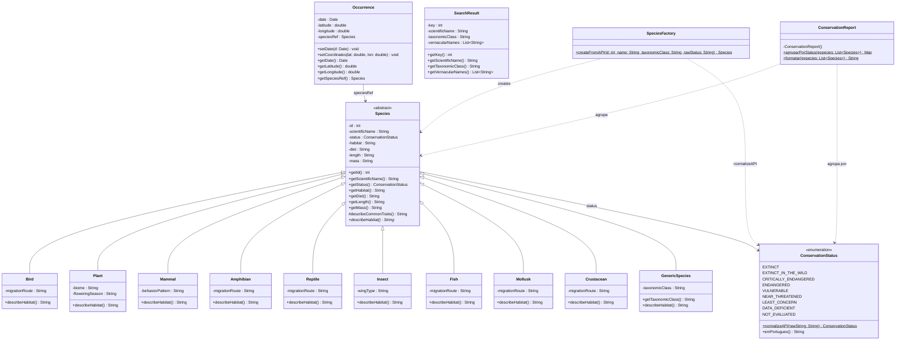
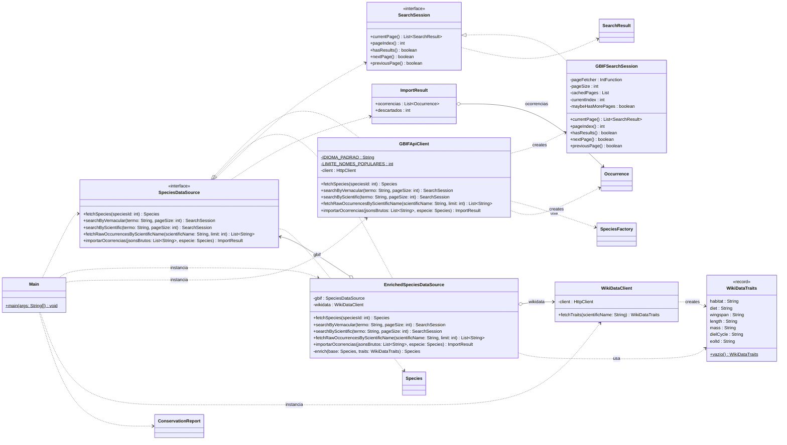

# Diagramas de Classes

## 1. Modelo de domínio (`model` e `factory`)

```mermaid
classDiagram
    direction TB

    class ConservationStatus {
        <<enumeration>>
        EXTINCT
        EXTINCT_IN_THE_WILD
        CRITICALLY_ENDANGERED
        ENDANGERED
        VULNERABLE
        NEAR_THREATENED
        LEAST_CONCERN
        DATA_DEFICIENT
        NOT_EVALUATED
        +normalizeAPI(rawString: String)$ ConservationStatus
        +emPortugues() String
    }

    class Species {
        <<abstract>>
        -id : int
        -scientificName : String
        -status : ConservationStatus
        -habitat : String
        -diet : String
        -length : String
        -mass : String
        +getId() int
        +getScientificName() String
        +getStatus() ConservationStatus
        +getHabitat() String
        +getDiet() String
        +getLength() String
        +getMass() String
        #describeCommonTraits() String
        +describeHabitat()* String
    }

    class Bird {
        -migrationRoute : String
        +describeHabitat() String
    }
    class Plant {
        -biome : String
        -floweringSeason : String
        +describeHabitat() String
    }
    class Mammal {
        -behaviorPattern : String
        +describeHabitat() String
    }
    class Amphibian {
        -migrationRoute : String
        +describeHabitat() String
    }
    class Reptile {
        -migrationRoute : String
        +describeHabitat() String
    }
    class Insect {
        -wingType : String
        +describeHabitat() String
    }
    class Fish {
        -migrationRoute : String
        +describeHabitat() String
    }
    class Mollusk {
        -migrationRoute : String
        +describeHabitat() String
    }
    class Crustacean {
        -migrationRoute : String
        +describeHabitat() String
    }
    class GenericSpecies {
        -taxonomicClass : String
        +getTaxonomicClass() String
        +describeHabitat() String
    }

    class Occurrence {
        -date : Date
        -latitude : double
        -longitude : double
        -speciesRef : Species
        +setDate(d: Date) void
        +setCoordinates(lat: double, lon: double) void
        +getDate() Date
        +getLatitude() double
        +getLongitude() double
        +getSpeciesRef() Species
    }

    class SearchResult {
        -key : int
        -scientificName : String
        -taxonomicClass : String
        -vernacularNames : List~String~
        +getKey() int
        +getScientificName() String
        +getTaxonomicClass() String
        +getVernacularNames() List~String~
    }

    class ConservationReport {
        -ConservationReport()
        +agruparPorStatus(especies: List~Species~)$ Map
        +formatar(especies: List~Species~)$ String
    }

    class SpeciesFactory {
        +createFromAPI(id: int, name: String, taxonomicClass: String, rawStatus: String)$ Species
    }

    Species <|-- Bird
    Species <|-- Plant
    Species <|-- Mammal
    Species <|-- Amphibian
    Species <|-- Reptile
    Species <|-- Insect
    Species <|-- Fish
    Species <|-- Mollusk
    Species <|-- Crustacean
    Species <|-- GenericSpecies

    Species --> ConservationStatus : status
    Occurrence --> Species : speciesRef

    SpeciesFactory ..> Species : creates
    SpeciesFactory ..> ConservationStatus : normalizeAPI
    ConservationReport ..> Species : agrupa
    ConservationReport ..> ConservationStatus : agrupa por
```

## 2. Camada de acesso a dados (`api`) e `Main`

```mermaid
classDiagram
    direction LR

    class SpeciesDataSource {
        <<interface>>
        +fetchSpecies(speciesId: int) Species
        +searchByVernacular(termo: String, pageSize: int) SearchSession
        +searchByScientific(termo: String, pageSize: int) SearchSession
        +fetchRawOccurrencesByScientificName(scientificName: String, limit: int) List~String~
        +importarOcorrencias(jsonsBrutos: List~String~, especie: Species) ImportResult
    }

    class SearchSession {
        <<interface>>
        +currentPage() List~SearchResult~
        +pageIndex() int
        +hasResults() boolean
        +nextPage() boolean
        +previousPage() boolean
    }

    class GBIFApiClient {
        -IDIOMA_PADRAO : String$
        -LIMITE_NOMES_POPULARES : int$
        -client : HttpClient
        +fetchSpecies(speciesId: int) Species
        +searchByVernacular(termo: String, pageSize: int) SearchSession
        +searchByScientific(termo: String, pageSize: int) SearchSession
        +fetchRawOccurrencesByScientificName(scientificName: String, limit: int) List~String~
        +importarOcorrencias(jsonsBrutos: List~String~, especie: Species) ImportResult
    }

    class EnrichedSpeciesDataSource {
        -gbif : SpeciesDataSource
        -wikidata : WikiDataClient
        +fetchSpecies(speciesId: int) Species
        +searchByVernacular(termo: String, pageSize: int) SearchSession
        +searchByScientific(termo: String, pageSize: int) SearchSession
        +fetchRawOccurrencesByScientificName(scientificName: String, limit: int) List~String~
        +importarOcorrencias(jsonsBrutos: List~String~, especie: Species) ImportResult
        -enrich(base: Species, traits: WikiDataTraits) Species
    }

    class WikiDataClient {
        -client : HttpClient
        +fetchTraits(scientificName: String) WikiDataTraits
    }

    class WikiDataTraits {
        <<record>>
        habitat : String
        diet : String
        wingspan : String
        length : String
        mass : String
        dielCycle : String
        eolId : String
        +vazio()$ WikiDataTraits
    }

    class GBIFSearchSession {
        -pageFetcher : IntFunction
        -pageSize : int
        -cachedPages : List
        -currentIndex : int
        -maybeHasMorePages : boolean
        +currentPage() List~SearchResult~
        +pageIndex() int
        +hasResults() boolean
        +nextPage() boolean
        +previousPage() boolean
    }

    class ImportResult {
        +ocorrencias : List~Occurrence~
        +descartados : int
    }

    class Main {
        +main(args: String[])$ void
    }

    class Species
    class Occurrence
    class SearchResult
    class SpeciesFactory
    class ConservationReport

    SpeciesDataSource <|.. GBIFApiClient
    SpeciesDataSource <|.. EnrichedSpeciesDataSource
    SearchSession <|.. GBIFSearchSession

    EnrichedSpeciesDataSource o--> SpeciesDataSource : gbif
    EnrichedSpeciesDataSource o--> WikiDataClient : wikidata
    WikiDataClient ..> WikiDataTraits : creates
    EnrichedSpeciesDataSource ..> WikiDataTraits : usa

    GBIFApiClient ..> GBIFSearchSession : creates
    GBIFApiClient ..> SpeciesFactory : usa
    GBIFApiClient ..> Occurrence : creates

    SpeciesDataSource ..> SearchSession
    SpeciesDataSource ..> ImportResult
    SpeciesDataSource ..> Species
    SearchSession ..> SearchResult
    ImportResult o--> Occurrence : ocorrencias

    Main ..> SpeciesDataSource
    Main ..> EnrichedSpeciesDataSource : instancia
    Main ..> GBIFApiClient : instancia
    Main ..> WikiDataClient : instancia
    Main ..> ConservationReport
```
